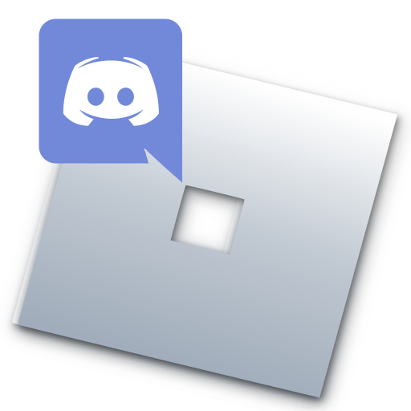

# roblox-rpc

	<b float="top">Roblox Rich Presence in Discord!</b> 
	

# How to use

To use, you need to download a version from <a  href="https://github.com/daimond113/roblox-rpc/releases">releases</a>, and install the .exe  

After doing that, you should run the program. There isn't many options avaliable yet. Currently you can only:

<ol>
<li>
Hide/Show the RPC window
</li>
</ol>

Of course, more features will be added **_Soon™_**

# Want to contribute or report a bug?

Any kind of contribution is welcome! You can do that on the <a  href="https://github.com/daimond113/roblox-rpc">GitHub page.</a>
